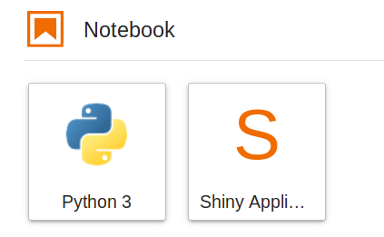
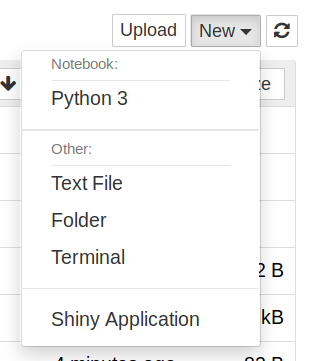

==========================
Jupyter Launcher Shortcuts
==========================

Extensions for JupyterLab and classic Jupyter Notebook to add
**user defined** 'launcher' shortcuts. Primarily useful in 
JupyterHub / Binder situations.

For JupyterLab, they're added in the launcher interface.

For classic Jupyter Notebook, they are added under the 'New' button

Installation
============

The JupyterLab extension, notebook server extension & classic notebook extension
can be installed with ``pip``.

.. code:: bash

   pip install jupyter-launcher-shortcuts

Configuring
===========

The extension can be configured in a ``jupyter_server_config.py``
file created in any of the directories under ``config`` in the 
output of ``jupyter --paths`` command.

.. code:: python
   
   c.LauncherShortcuts.shortcuts = {
       'my-shiny-application': {
           'title': 'Human Readable Shortcut Title',
           'target': '{base_url}shiny/my-shiny-application-directory/',
           'icon_path': '/path/to/svg/file'
       }
   }